title: 图解HTTP
speaker: 杨国超
url: lpgray.vipsinaapp.com
files: /css/theme.txbb.css
transition: zoomout

<slide>
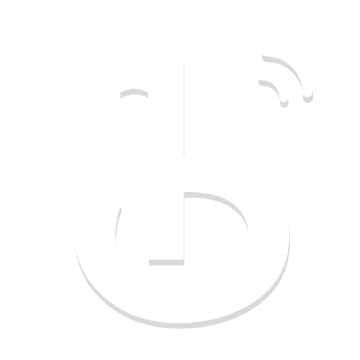
# 图解HTTP

内容摘自《图解HTTP》

<slide>
# 分享目标
- WEB 及其网络的基础
- 了解WEB中涉及常用的协议
- 确保Web安全的HTTPS

<slide>

# WEB 及其网络的基础 #
## TCP/IP 分层管理 ##
- ISO制定的OSI参考模型的过于庞大、复杂招致了许多批评。与此对照，由技术人员自己开发的TCP/IP协议栈获得了更为广泛的应用。

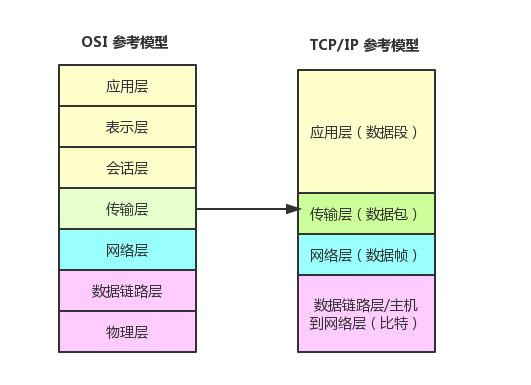
<slide>

- 接下来的图，主要说明各个层的作用和各层涉及到协议：

<slide>

- 应用层：直接为用户的应用进程（例如电子邮件、文件传输和终端仿真）提供服务。

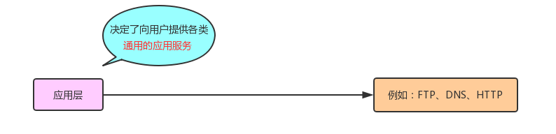

常用协议：DNS, Telnet, Http, FTP
<slide>
 传输层:负责向两个主机中进程之间的通信提供服务。
传输控制协议TCP(Transmission Control Protocol)

	1. 安全可靠，无差错，不丢失，仅支持一对一通信
	2. 链接三次握手，断开四次挥手。
	3. 缺点： 效率低
	4. 应用： 文件传输。
	

 用户数据包协议UDP(User Datagram Protocol)

	1. 无连接，支持一对多，效率要求高，准确性相对低的场景，（视频会议、直播）

<slide>
 网络层：传输数据包。

	1. IP,ARP,RARP
	2. 使用ARP协议凭借MAC地址进行通信 IP间通信通信依赖MAC地址。通信的双方通常会经过多台计算机和网络设备中转才能连接到对方，而在进行中转时，会利用下一站中转设备的MAC地址来搜索下一个中转目标。这时，会采用ARP协议。该协议是一种用以解析地址的协议，根据通信方的IP地址就可以反查出对应的MAC地址。
	3. IP协议网际互连协议，版本有 IPV4 IPV6

<slide>
链路层/物理层： 处理连接网络的硬件部分。

    1. 网卡， 交换机，集线器  

<slide>
## 总结， 发送端与接收端的流程： ##
 

 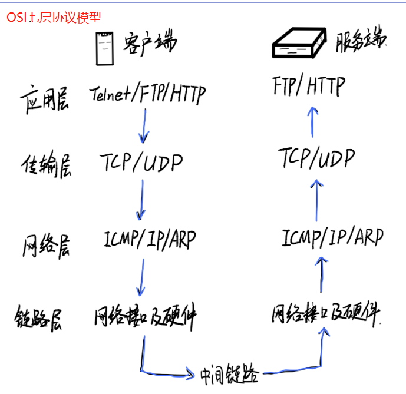

<slide>
#  问题：为什么采取分层管理？ #

<slide>
答：

	1. 大的问题拆分成小，并且小的问题，边界标准化，出现问题方便锁定。
	2. 各自独立，各司其职。
	3. 类似开发中的高内聚，低耦合。

<slide>

## 问题2：从浏览器输入 URL 到页面展示如何建立连接的？ ##

<slide>
### 1、输入地址 ###

	- 传输协议：http，https
	- Protocol :// hostname[:port] /path /filename
	- URL的地址，比如 “http://www.baidu.com/index.html?name=mo&age=25#dowell”，在这个例子中可以看到URL的组成部分：

<slide>

### 2、浏览器查找域名的 IP 地址 ###

 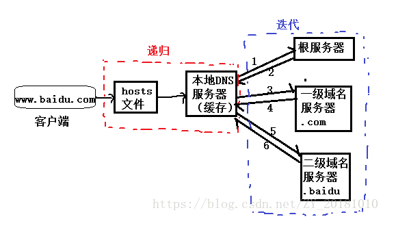

#### 什么是DNS？ ####
- 域名和IP地址相互映射
- DNS就相当于一个电话本，比如你要找http://www.baidu.com这个域名，那我翻一翻我的电话本，我就知道，哦，它的电话（ip）是167.23.10.2。
- 递归解析: 如果主机所询问的本地域名服务器不知道被查询的域名的IP地址，那么本地域名服务器就以DNS客户的身份，向其它根域名服务器继续发出查询请求报文(即替主机继续查询)，而不是让主机自己进行下一步查询。
- 迭代查询: 当根域名服务器收到本地域名服务器发出的迭代查询请求报文时，要么给出所要查询的IP地址，要么告诉本地服务器：“你下一步应当向哪一个域名服务器进行查询”。然后让本地服务器进行后续的查询。

<slide>
### 3、浏览器向 web 服务器发送一个 HTTP 请求 ###

<slide>
## 建立连接 ##
### TCP的三次握⼿ ###
- 原因：为了准确无误地将数据送达目标处，TCP协议在发送数据的准备阶段采用了三次握手策略（若在握手过程中某个阶段中断，TCP协议会再次以相同的顺序发送相同的数据包）。
	
#### 知晓一些标识符 ####
	
	1. SYN：同步标志
	2. ACK：确认标志
	3. FIN：结束标志

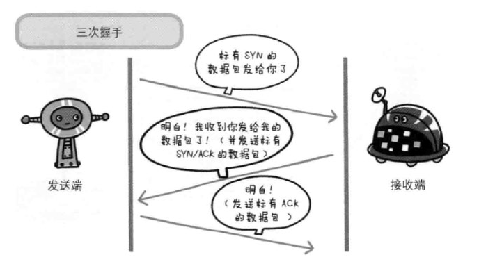

<slide>

## 数据传输: ##
 #### HTTP协议在TCP/IP 协议中的数据传输 ####
通信传输流程图，如下所示：

<slide>
	
1. 利用TCP/IP协议族网络通信时，通过分层顺序与对方通信:
    - 发送方：从应用层往下进行
	- 接收方：从下往应用层进行

<slide>
2. 首先传输层（TCP协议）
	
    - 把从应用层接受的数据（HTTP 请求报文）分割
	- 在各个报文上打上标记序号（TCP 具有按序性）及端口号
	- 转发给网络层
	
<slide>
3. 其次到网络层（IP协议）	
    - 在传输层整理完的数据基础上，增加通信目的地的 MAC地址转发给链路层
	
 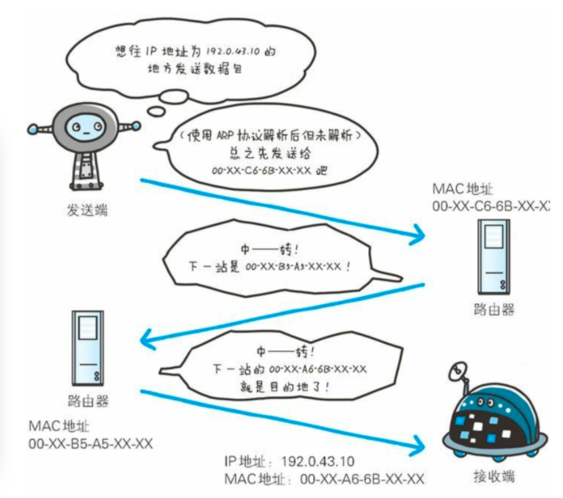

<slide>
4. 然后到接收端的链路层 
  - 接收数据，按顺序往上层发送 
  - 传输到服务器端的应用层时，服务器才接收到客户端发送来的 HTTP 请求

<slide>
5. 客户端发送的请求数据，在经历层层传输时，势必会被每层所属的首部信息包裹，这叫做 封装。同理，从链路层往服务器端的应用层向上传输时，每层对应的首部信息也会层层剥去。如下图：
	- 在每个协议层下会封装发送者的信息，比如网络层的MAC地址，TCP层的
	- 每⼀层中都会进⾏数据封装
	
 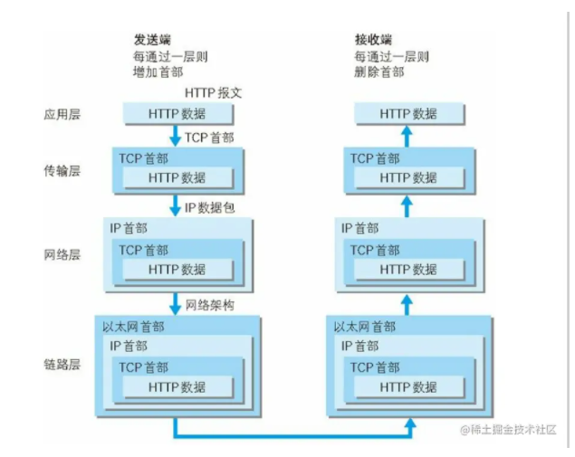

<slide>

## 浏览页面的过程总结 ##

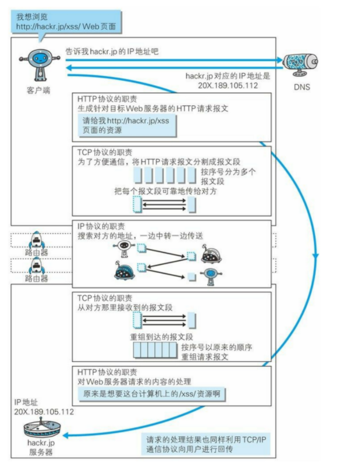

<slide>

## 解除连接： ##
 #### TCP的四次挥⼿ ####

#### 知晓一些标识符 ####
	
	1. SYN：同步标志
	2. ACK：确认标志
	3. FIN：结束标志

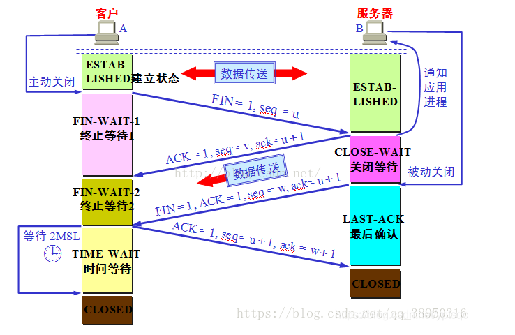

<slide>

#### 问题：为什么建立连接是三次握手，解除连接是四次 ####

<slide>

 
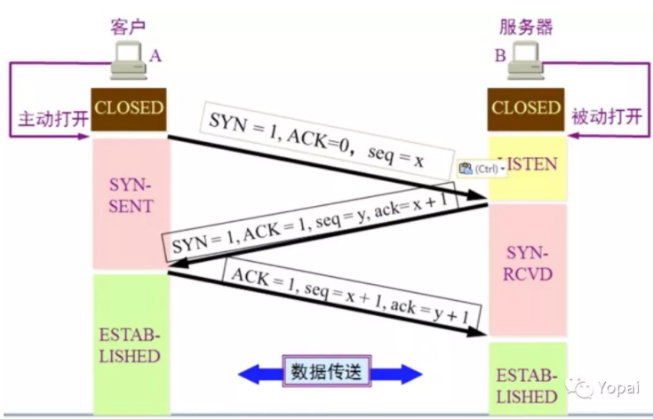 

服务端在LISTEN状态下，收到建立连接请求的SYN报文后，把ACK和SYN放在一个报文里发送给客户端。

而关闭连接时，当收到对方的FIN报文时，仅仅表示对方不再发送数据了但是还能接收数据，己方是否现在关闭发送数据通道，需要上层应用来决定，因此，己方ACK和FIN一般都会分开发送。

<slide>
# 确保Web安全的HTTPS #

<slide>

## HTTP的缺点 ##

- 通信使用明文（不加密），可能会被窃听；
- 不验证通信方的身份，可能遭到伪装；
- 无法证明报文的完整性，可能已遭篡改；

<slide>

## HTTPS的诞生 ##
由于 HTTP 的以上缺点，为了确保安全就诞生了HTTPS。简单的说 ** HTTPS = HTTP + 加密 + 认证 + 完整性保护**。HTTPS并不是一种新的协议，只是HTTP通信接口部分用SSL和TLS协议代替而已。例如，HTTP直接和TCP通信，使用了SSL时候，就会演变为先和SSL通信，再由SSL和TCP通信。

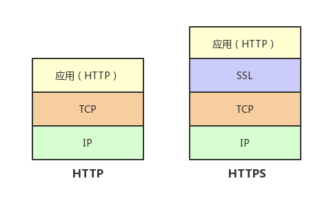

<slide>
## 问题： 调试 https 为啥需要证书 ##

<slide>

## 需要的证书是指什么？ ##

	- SSL证书
	- 实际上就是CA机构对用户公钥的认证，内容包括电子签证机关的信息、公钥用户信息、公钥、权威机构的签字和有效期等。
	- CA（数字证书认证，Certificate Authority）机构，是承担公钥合法性检验的第三方权威机构

<slide>

## 为什么需要证书 ##

<slide>

#### 1. SSL证书可提供身份验证，防止钓鱼网站 ####

类似身份证，证明你就是你，而不是别人。避免被伪装。
SSL证书可提供身份验证。这意味着您可以确保将信息发送到正确的服务器，不用担心别人窃取您的信息。有效的防止第三方伪装成您的网站并欺骗您的用户，获取用户个人信息，造成或大或小的损失。而SSL证书是由受信任的CA机构颁发的，申请证书时会严格的验证企业/组织的信息。

<slide>

 #### 2. SSL证书可增加信任度，消除浏览器“不安全”提示 ####
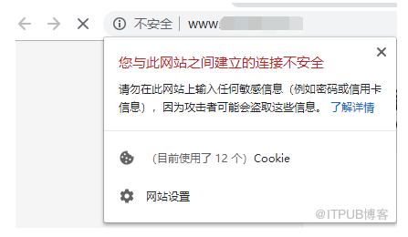

<slide>

#### 有利于seo关键词排名 #### 
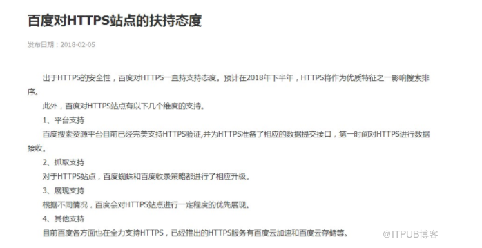

<slide>
## 后续会介绍 数字证书，数字签名，敬请期待。。。 ##

# Thanks #

